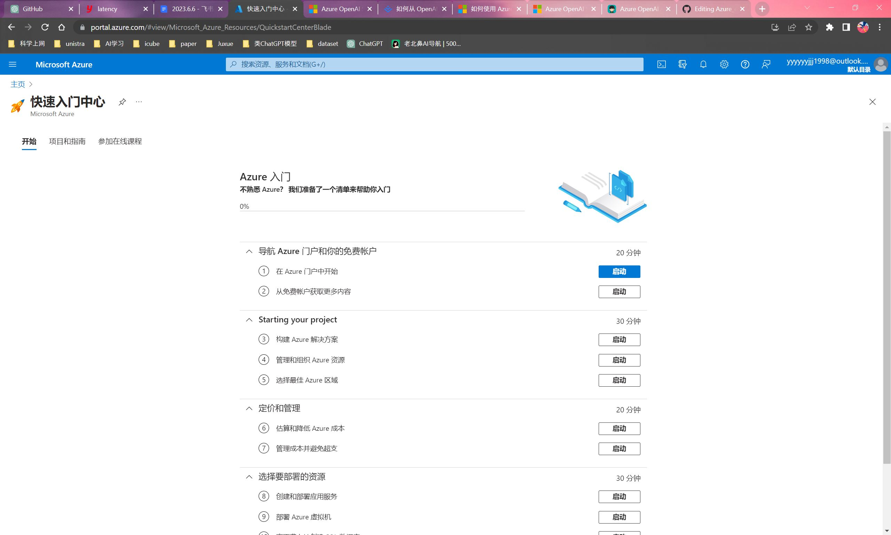
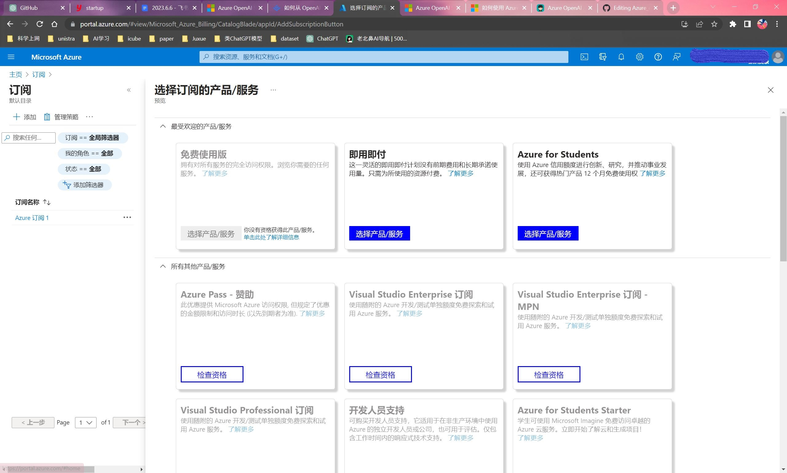
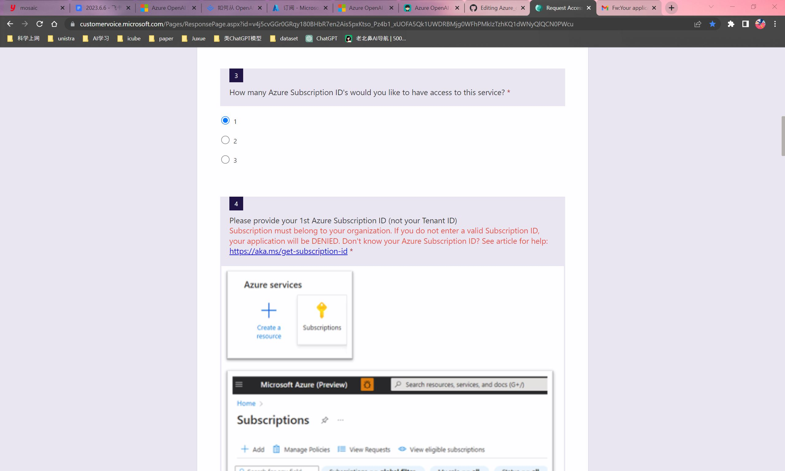
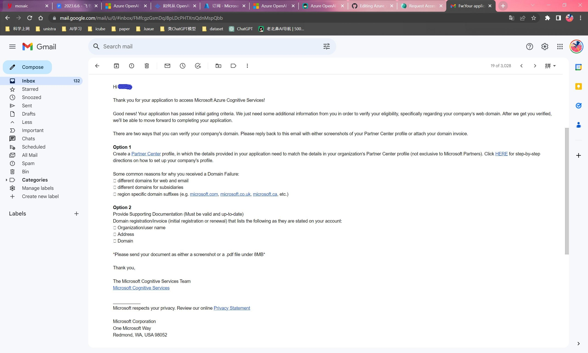
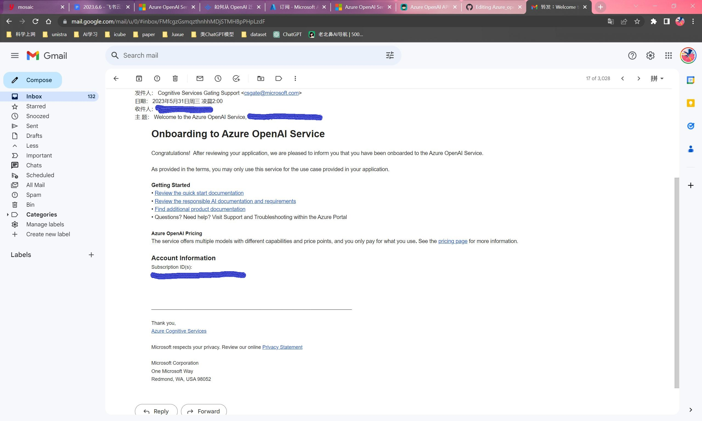

# Azure_openai

Microsoft Azure OpenAI Service 申请，部署与 API 调用

## 申请

### 准备工作

- 微软账户
- Visa 卡或万事达卡
- 公司邮箱或学校教育邮箱

### Azure 注册

-  Azure 注册链接: `signup.azure.com`，注册完毕后进入快速入门中心界面
-  注册时在国内信用卡不可切换地区

### 订阅 ID

- 在 `https://portal.azure.com/#home`界面，点击`订阅`，可以看到当前免费订阅，状态栏显示`可用`或`已禁用`,这是因为我们还没有激活或尚未升级订阅
- 点击 `添加`后，在 `选择订阅的产品/服务`一栏下有三种可选服务：免费使用版，即用即付，Azure for students。免费使用版：我没有资格使用。Azure for students：如果是学生身份可申请。即用即付：用多少付多少

- 点击`即用即付`旁边的`升级`按钮，而后选择方案，这里我们选择`基本`后点击`升级`，等待一会之后就能看到订阅 ID 

### 申请 Azure OpenAI Service

- 现在我们已经有了 Azure 的订阅 ID ，需要申请 Azure OpenAI Service 后才能使用，这里给出申请链接，需要先有 Azure OpenAI Service 才能申请 GPT-4
- Request Access to Azure OpenAI Service : `aka.ms/oai/access`
- Azure OpenAI GPT-4 Public Preview Waitlist : `aka.ms/oai/get-gpt4`
- 总共有约25个选项。注意要提供公司信息，网址，电话等。如果需要多个服务的话则需要提供多个订阅 ID ，这里我们勾选一个

- 我在填写完毕两天后收到了补交材料的邮件，需要提供 company’s web domain 用以验证公司身份

- 提交完毕后收到 onboarding 邮件，可以使用 Azure OpenAI Service 了

## 部署

## 使用

调用API 网页端
