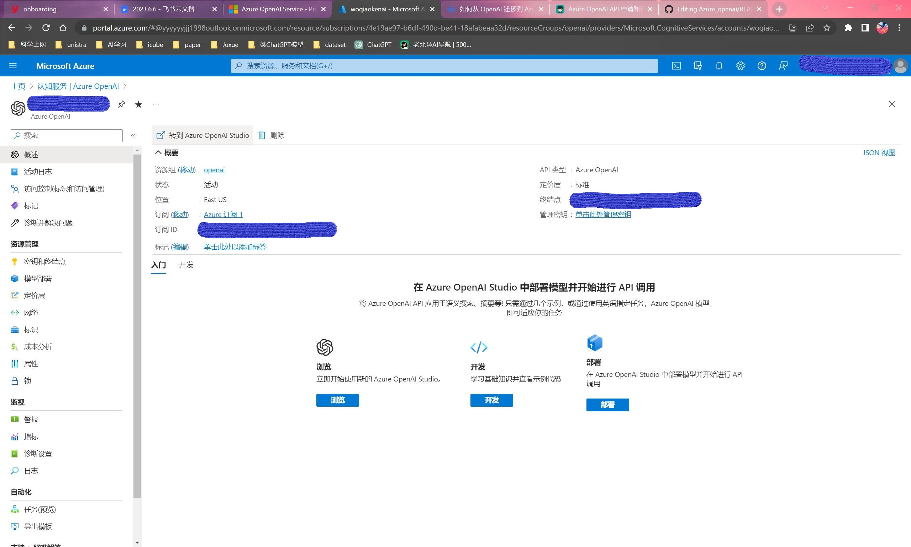
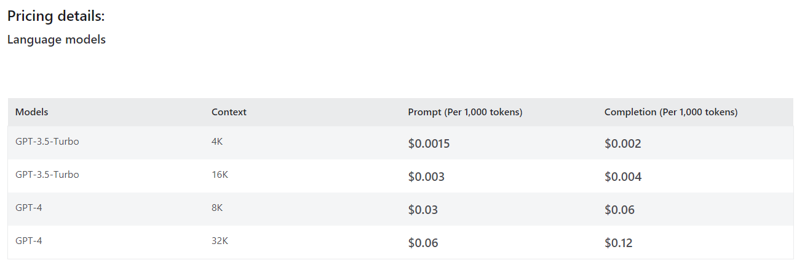

# Azure_openai 指南

Microsoft Azure OpenAI Service 申请，部署与使用

# 目录

- [申请](#申请)
  - [准备工作](#准备工作)
  - [Azure 注册](#Azure-注册)
  - [订阅 ID](#订阅-ID)
  - [申请 Azure OpenAI Service](#申请-azure-openai-service)
- [部署](#部署)
- [使用](#使用)
  - [支持的模型及花费](#支持的模型及花费)
  - [聊天功能](#聊天功能)
  - [API调用](#api-调用)
  - [微调功能](#微调功能)
  - [内容过滤](#内容过滤)
- [参考资料](#参考资料)

[2023-9-11Update] gpt-4 and gpt-4-32k is available in Microsoft Azure OpenAI Service

## 申请

### 准备工作

- 微软账户
- Visa 卡或万事达卡
- 公司邮箱或学校教育邮箱

### Azure 注册

-  Azure 注册链接: `signup.azure.com`，注册完毕后进入快速入门中心界面
-  注册时在国内信用卡不可切换地区


### 订阅 ID

- 在 `https://portal.azure.com/#home`界面，点击`订阅`，可以看到当前免费订阅，状态栏显示`可用`或`已禁用`,这是因为我们还没有激活或尚未升级订阅
- 点击 `添加`后，在 `选择订阅的产品/服务`一栏下有三种可选服务：免费使用版，即用即付，Azure for students。免费使用版：我没有资格使用。Azure for students：如果是学生身份可申请。即用即付：用多少付多少


- 点击`即用即付`旁边的`升级`按钮，而后选择方案，这里我们选择`基本`后点击`升级`，等待一会之后就能看到订阅 ID 


### 申请 Azure OpenAI Service

- 现在我们已经有了 Azure 的订阅 ID ，需要申请 Azure OpenAI Service 后才能使用，这里给出申请链接，需要先有 Azure OpenAI Service 才能申请 GPT-4
- Request Access to Azure OpenAI Service : `aka.ms/oai/access`
- Azure OpenAI GPT-4 Public Preview Waitlist : `aka.ms/oai/get-gpt4`
- 总共有约25个选项。注意要提供公司信息，网址，电话等。如果需要多个服务的话则需要提供多个订阅 ID ，这里我们勾选一个


- 我在填写完毕两天后收到了补交材料的邮件，需要提供 company’s web domain 用以验证公司身份


- 提交完毕后收到 onboarding 邮件，可以使用 Azure OpenAI Service 了


## 部署

- 在 Azure OpenAI 里点击`创建`，新建一个资源组，注意这里的名称，它会成为调用 api 地址的域名之一，假如填写 “juxue-openai”，最后我得到的 Azure OpenAI 的调用 api 地址是 `https://juxue-openai.openai.azure.com/`


- 网络选择 `所有网络`
- 标记部分不用填，最后审阅 + 提交，等待一会提示部署完成。在下面的界面上可以管理密钥



- 接下来到 Azure OpenAI studio - Deployment 界面，点击 `create new deployment`,从 OpenAI 提供的模型类型中选择 `gpt-35-turbo` 部署


- endpoint(终结点)为 API 调用地址
- 管理密钥下可以看到 Azure 生成的两个密钥
- `api-version`：API 的版本，目前仅支持三个 version，分别是 2023-03-15-preview，2022-12-01，2023-05-15
- 有了 API 地址和密钥后，就可以调用 Azure OpenAI Service 

## 使用

### 支持的模型及花费



### 聊天功能

在 Azure AI Studio 的 `Chat playground` 中使用聊天功能


### API-调用

调用 API 示例如下，其中，密钥可在 Azure OpenAI 中查看，调用 API URL为：
`https://openai资源名称.openai.azure.com/openai/deployments/部署的模型名称/completions?api-version=2023-03-15-preview`

```
import openai
openai.api_type = "azure"
openai.api_base = "https://openai资源名称.openai.azure.com/"
openai.api_version = "2023-03-15-preview"
openai.api_key = 'your-personal-key'

response = openai.ChatCompletion.create(
  engine="部署的模型名称",
  messages = [{"role":"system","content":"You are an AI assistant that helps people find information."},
  {'role':'user','content':'这里输入你的问题'}],
  temperature=0.7,
  max_tokens=800,
  top_p=0.95,
  frequency_penalty=0,
  presence_penalty=0,
  stop=None)
```
### 微调功能

Azure AI Studio 中的微调工作流要求执行以下步骤：

- 准备训练和验证数据
- 使用 Azure AI Studio 中的“创建自定义模型”向导来训练自定义模型
- 选择基础模型
- 选择训练数据
- 检查所做的选择并训练新的自定义模型
- 检查自定义模型的状态
- 部署自定义模型以供使用

其中可选择的模型与 OpenAI 官网开放的微调模型类别相同为以下几种：`ada, babbage, curie, code-cushman-001, davinci`

### 内容过滤

Azure OpenAI服务包括一个内容过滤系统，与核心模型一起工作。该系统的工作方式是通过分类模型的集合来运行提示和完成，旨在检测和防止有害内容的输出。该内容过滤系统在输入提示和输出完成中检测特定类别的潜在有害内容并采取行动。API配置和应用程序设计的变化可能会影响完成度，从而影响过滤行为
- 该内容过滤系统支持以下语言： 英语、德语、日语、西班牙语、法语、意大利语、葡萄牙语和中文，它可能无法检测到未经训练或测试的语言中的不适当内容
- 其中包含四种评价指标：`Hate, Sexual, Violence, Self-harm`
- 针对不同的有害内容分为四种严重程度：`Safe, Low, Medium, High`

## 参考资料
1. [如何从 OpenAI 迁移到 Azure OpenAI 🧐（保姆级教程，包含如何兼容 JS 语言版 LangChain）](https://juejin.cn/post/7241095368179826748)
2. [Azure OpenAI的使用指南](https://zhuanlan.zhihu.com/p/618541541)
3. [Azure OpenAI API 申请和使用](https://razeen.me/posts/how-to-apply-and-use-azure-openai-api/)
4. [Azure OpenAI Service申请链接](aka.ms/oai/access)
5. [Azure OpenAI GPT-4申请链接](aka.ms/oai/get-gpt4)
