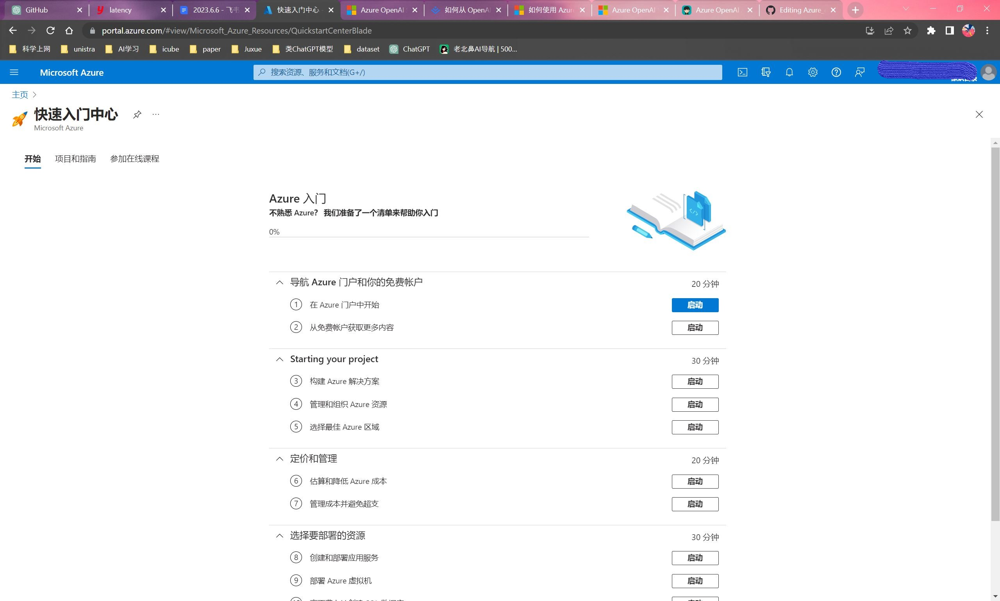
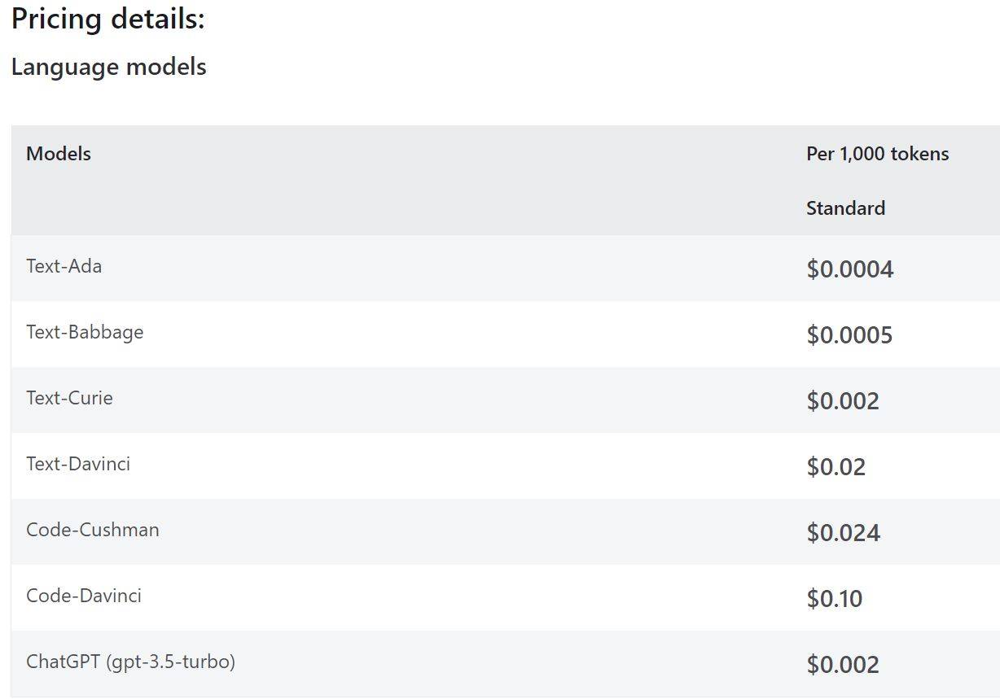

# Azure_openai

Microsoft Azure OpenAI Service 申请，部署与 API 调用

## 申请

### 准备工作

- 微软账户
- Visa 卡或万事达卡
- 公司邮箱或学校教育邮箱

### Azure 注册

-  Azure 注册链接: `signup.azure.com`，注册完毕后进入快速入门中心界面
-  注册时在国内信用卡不可切换地区



### 订阅 ID

- 在 `https://portal.azure.com/#home`界面，点击`订阅`，可以看到当前免费订阅，状态栏显示`可用`或`已禁用`,这是因为我们还没有激活或尚未升级订阅
- 点击 `添加`后，在 `选择订阅的产品/服务`一栏下有三种可选服务：免费使用版，即用即付，Azure for students。免费使用版：我没有资格使用。Azure for students：如果是学生身份可申请。即用即付：用多少付多少


- 点击`即用即付`旁边的`升级`按钮，而后选择方案，这里我们选择`基本`后点击`升级`，等待一会之后就能看到订阅 ID 


### 申请 Azure OpenAI Service

- 现在我们已经有了 Azure 的订阅 ID ，需要申请 Azure OpenAI Service 后才能使用，这里给出申请链接，需要先有 Azure OpenAI Service 才能申请 GPT-4
- Request Access to Azure OpenAI Service : `aka.ms/oai/access`
- Azure OpenAI GPT-4 Public Preview Waitlist : `aka.ms/oai/get-gpt4`
- 总共有约25个选项。注意要提供公司信息，网址，电话等。如果需要多个服务的话则需要提供多个订阅 ID ，这里我们勾选一个


- 我在填写完毕两天后收到了补交材料的邮件，需要提供 company’s web domain 用以验证公司身份


- 提交完毕后收到 onboarding 邮件，可以使用 Azure OpenAI Service 了


## 部署

- 在 Azure OpenAI 里点击`创建`，新建一个资源组，注意这里的名称，它会成为调用 api 地址的域名之一，假如填写 “juxue-openai”，最后我得到的 Azure OpenAI 的调用 api 地址是：https://juxue-openai.openai.azure.com/


- 网络选择 `所有网络`
- 标记部分不用填，最后审阅 + 提交，等待一会提示部署完成。在下面的界面上可以管理密钥


- 接下来到 Azure OpenAI studio - Deployment 界面，点击 `create new deployment`,从 OpenAI 提供的模型类型中选择 `gpt-35-turbo` 部署


- endpoint(终结点)为 API 调用地址
- 管理密钥下可以看到 Azure 生成的两个密钥
- `api-version`：API 的版本，目前仅支持三个 version，分别是 2023-03-15-preview，2022-12-01，2023-05-15
- 有了 API 地址和密钥后，就可以调用 Azure OpenAI Service 

## 使用

### 支持的模型及花费



### 聊天功能

在 Azure AI Studio 的 `Chat playground` 中使用聊天功能


### API 调用

调用 API 示例如下，其中，密钥可在 Azure OpenAI 中查看，调用 API URL为：
https://openai资源名称.openai.azure.com/openai/deployments/部署的模型名称/completions?api-version=2023-03-15-preview


```
import openai
openai.api_type = "azure"
openai.api_base = "https://openai资源名称.openai.azure.com/"
openai.api_version = "2023-03-15-preview"
openai.api_key = 'your-personal-key'

response = openai.ChatCompletion.create(
  engine="部署的模型名称",
  messages = [{"role":"system","content":"You are an AI assistant that helps people find information."},
  {'role':'user','content':'这里输入你的问题'}],
  temperature=0.7,
  max_tokens=800,
  top_p=0.95,
  frequency_penalty=0,
  presence_penalty=0,
  stop=None)
```
